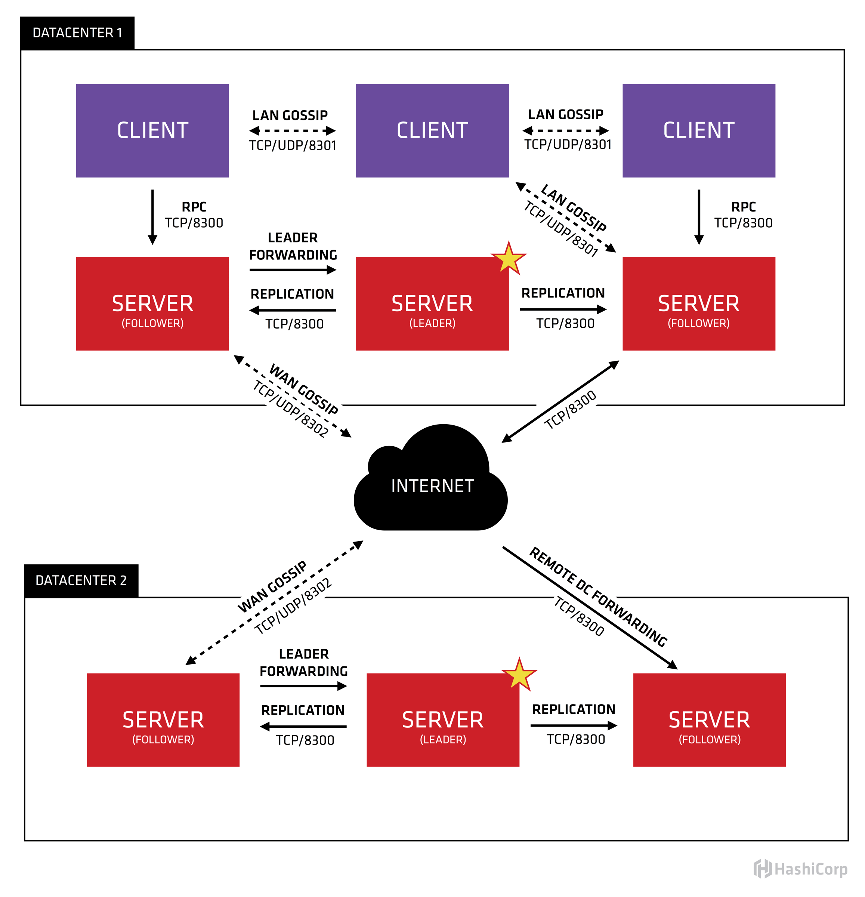

# Consul

## Concept de base

Permet d'adresser en terme de service et non plus IP/DNS  
Un service = Une instace (app,BDD etc...)  
Une couche d'abstraction au dessus des IP/Ports  

Permet de faire du :
- service registry: stocke les infos pour les rendre dispo (via API)
- service discovery
- possede des health check
- Facilite les maintenances (rentrer, sortir une machine)

Similaire a docker-compose  

## Architecture

### Consul server

Vocation a stocker et presenter des donnees aux autres services  
La resgistry de service  

### Consul client

Fait remonter les elements au serveur

## Utilisation

Une fois un agent installe,voici quelques cas d'usages : 

* modification automatique de configuration
* utilisation de l'API
* exemple : consul-template et haproxy
* plus besoin de toucher a la conf centralisee(uniquement cote age)
* load balancer directement (si peut pousser...via url)
* !!! on ne parle qu'a l'url du service

## Tags

Permet d'ajouter des metadonnees a un service :
- version
- type
- url
- env etc...

Tag pouvant etre ajoute via :
- fichier de conf
- API
- Module Ansible
- Librarie applicative type java (python ?)

## DNS SRV

Consul sert de serveur DNS  
SRV = mieux qu'un DNS pour faire du LB  
On peut avoir de la prio et un poids  

Ex: myapp.service.consul  

Peut se couper avec dnsmasq (petit serveur DNS qui met en cache et vous permet d'ajouter des resolutions de nom pour ls hotes du reseau loc)  

## Consul Sync 

On peut automatiquement ajouter les pods K8s dans consul grace a consul-sync (helm release)

## Consul Connect

Avant architecture monolithique (ex: app de banque qui permet de regarder son compter, virer de l'argent, changer de devise etc...)  
Maintenant chaque brique est un pod + de flexibilite  
Mais les echanges sont plus nombreux et securite beaucoup plus complexe (avant DMZ <--> app <--> BDD). Surtout avec des pods volatile tres nombreux  

Consul connect permet de resoudre ces problematiques : 
- Dans chaque pod d'ajouter un conteneur (sidecar) qui sert de proxy et qui va set up une flux mTLS (mutual TLS). Donc comme pour un reverse proxy on ne modifie pas l'app de base qui ne saurait pas faire de TLS potentiellement
- Il genere a la volee les certifs TLS voir se connecte a une CA externe
- Simplifie les ACL, grace a un systeme de tag (webserver <-- ALLOW --> app). Les pods ayant tous des tag
