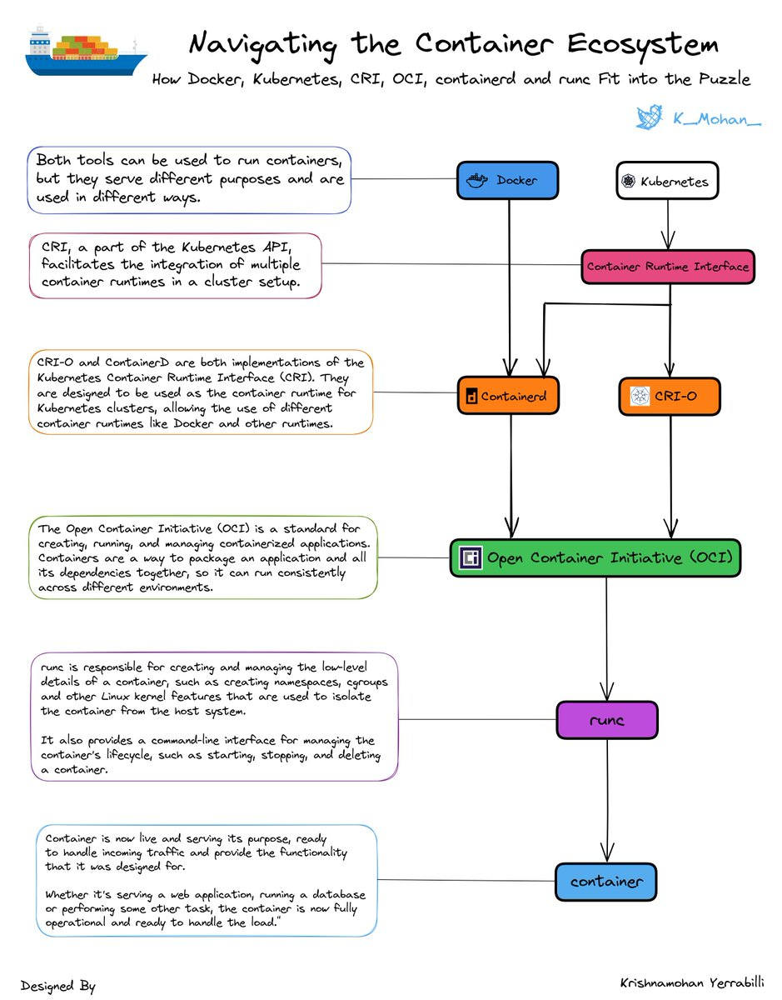
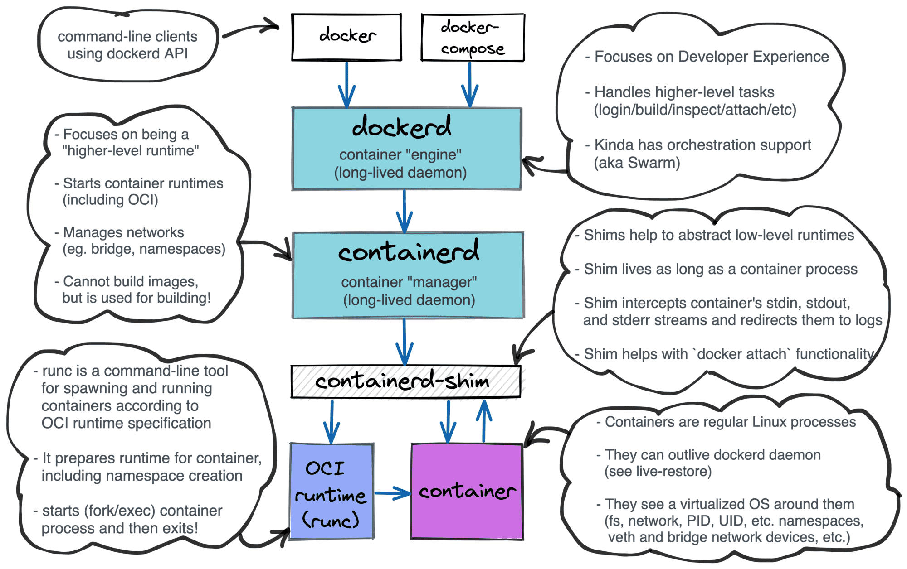
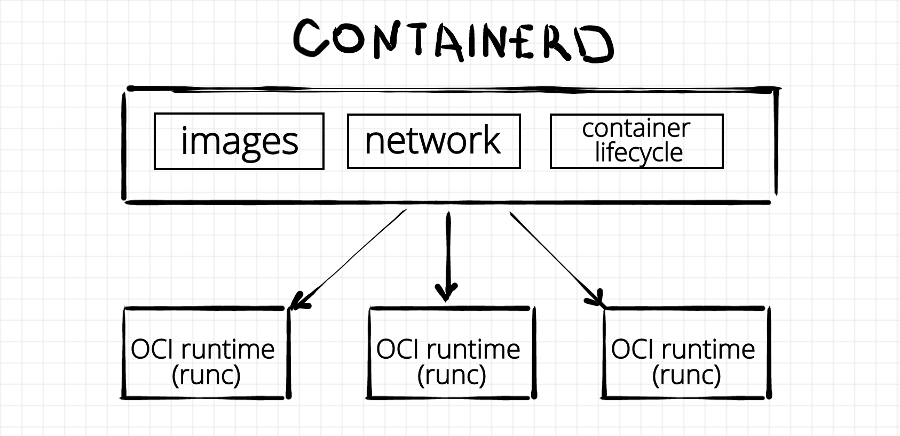
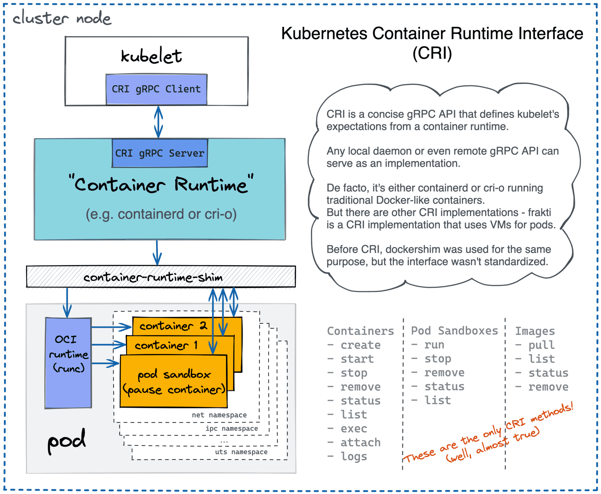
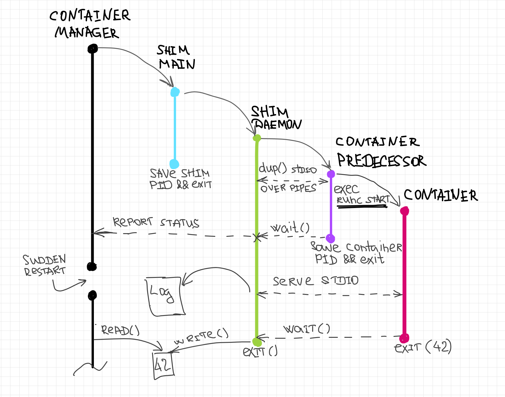

# Tips

# Lexique

**Dangling** images are layers that have no relationship to any tagged images. They no longer serve a purpose and consume disk space.  
**Unused** image is an image that has not been assigned or used in a container.

## DockerFile

**ENTRYPOINT vs CMD** : Version courte, c'est la meme chose, sauf quand tu as les 2, CMD devient l'argument de **ENTRYPOINT**  
The **EXPOSE** instruction does not actually publish the port. It functions as a type of documentation between the person who builds the image and the person who runs the container  

## Storage 

Plusieurs types de storage driver :  
- AUFS  
- ZFS  
- BTRFS  
- Device mapper  
- Overlay  
- Overlay2  

Ils ne sont pas tous disponible sur tous les OS, versions etc... Docker choisis le plus adapté mais on peut toujours en choisir un autre si besoin particulier  

# Detail Container

## Container Runtime

cgroups : Limite le CPU et la RAM de chaque container
Linux namespace : Virtualise les ressources systèmes (fs, networking etc...)

Cela correspond à un set de responsabilité tel que :  
- Créer le namespace  
- Lancer le process  
- Gestion des images etc...  

On peut compter dedans : runc, lxc, lmctfy, Docker (containerd), rkt, cri-o etc... 
Certain sont build sur d'autres (containerd on top of runc) et ils apportent des fonctionnalités de plus ou moins low/high level

On entend par :
- High level : image management, gRPC/Web APIs etc...  
- Low level: les container runtimes qui se concentrent sur juste run les containers  

Ces runtime sont standardisés via OCI (Open Container Initiative) dans ce qu'on appelle OCI runtime specification. En résumé il décrit un morceau de software qui prend en entrée :  
- Un rootfs  
- Un fichier de conf (ressource limit, mountpoint etc...)  
- Le lancement d'**un** seul process  

### RunC

C'est la reférence des implentation d'OCI runtime spec. Il faisait partie de Docker à la base donc écrit en GO

### Crun

RedHat a developpé ce OCI runtime implementation en C

## Container Manager

Une fois qu'on a un container runtime style runc on peut lancer des containers mais un container manager va nous permettre les choses suivantes :   
- Suivre leur statut (start, failed etc...)  
- Auto restart on failure  
- Pull image depuis des registries etc...  

On peut compter dedans : containerd, cri-o, dockerd, podman etc...

### containerd

Un héritage de Docker qui faisait partie lui aussi de ce projet. Maintenant containerd est self-sufficient.  
Contrairement à runC qui n'a qu'une CLI lui est un daemon. Il va pouvoir gérer des centaines de containers et garder leur status. Il est basé sur runc.
Il a aussi un support natif CRI pour Kube  

### cri-o

Créé par RedHat, un héritage de Kube. Au début Kube utilisait docker mais avec l'avenement d'autre runtimes il a fallu changer le code des kubelet (avec beaucoup de if..) alors Kube a ajouté le Container Runtime Interface (CRI)  

Afin d'être compatible CRI RedHat a créé cri-o. Il expose un gRPC server pour les actions de type start, stop etc... Il peut utiliser n'importe quel container runtime lowlevel pour gérer les container mais celui par défaut est runc. 
Il a été réfléchi pour être dédié à kube (même gestion de versionning, scope bien défini dans ce sens etc...)

### Dockerd

Basé sur containerd il fait l'interface entre l'API de docker et celle de containerd. Il propose aussi swarm ou compose  
Pas compatible Kubernetes, kube avait créé un code spécial pour lui : dockershim (solution temp). Il a fini par être remove en 2022. Docker se focalise surtout sur le dev local et pas l'execution en prod (style k8s)  

### Podman

**Daemonless** Projet RedHat. Fourni une librairie libpod pour manager des images, lifecycle des containers et les pods.  
Et podman est la cli build on top de cette librairie. Il utilise runc pour le lowlevel.  
Compatible avec la CLI de docker (pull, start etc...)  
Il régle la question des privilèges, 100% rootless si voulu.  

## Runtime Shim

Morceau de software qui réside entre le container runtime (runc) et le container manager (containerd, podman etc...)  
Fourni en général les fonctions suivantes :  
- Redirige stdout and stderr  
- Attach (stdin) dans le container  
- Exit code du container  
- Synchronise le status de la creation (sucess, failed) au container manager  

Le shim main n'a qu'un seul objectif fork le shim daemon et exit afin de bien détacher l'execution du container manager du shim daemon (indépendant)  
Il detache stdio (standard input/ouput) en redirigeant vers /dev/null pusi lance le container predecessor.  
Lui même va executer runc avec le bundle, la config etc... Une fois lancé il s'exit et shim renvoi le statut au container manager.

## Capabilities  

A set of default "permissions" for a container. Ex of allowed default capa: CHOWN (Make arbitrary changes to file UIDs and GIDs), SETUID, KILL, MKNOD etc...  
Can be used with docker command, ex for NTPD container :  
`docker run -d --cap-add SYS_TIME ntpd`

## SECCOMP

Secure Computing Mode is a kernel feature that allows you to filter system calls to the kernel from a container.  
More precised than capabilities, under JSON file (ex here : https://github.com/moby/moby/blob/master/profiles/seccomp/default.json)  
`docker run --security-opt seccomp=/path/to/default/profile.json <container>`
