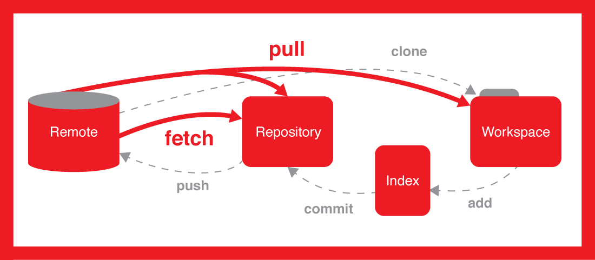
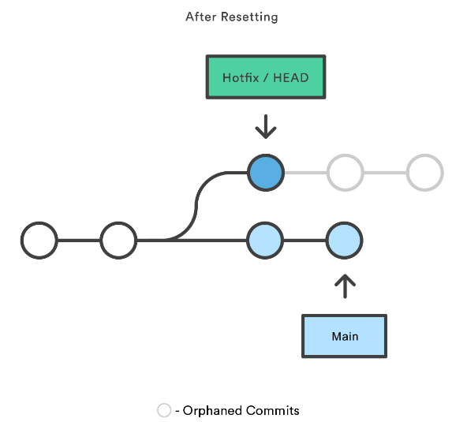
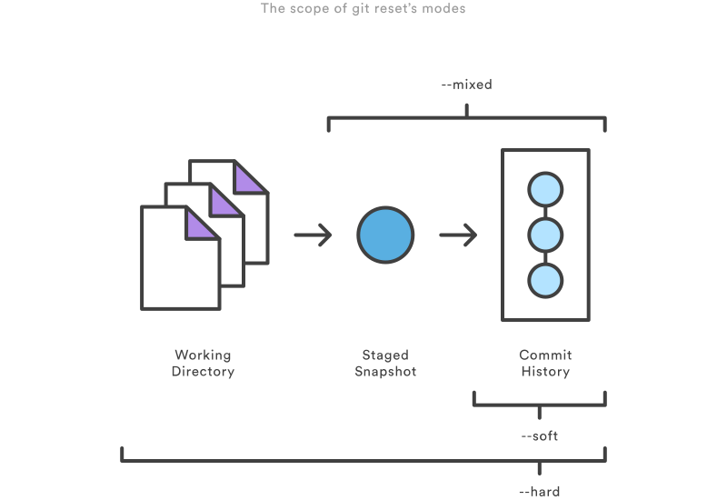
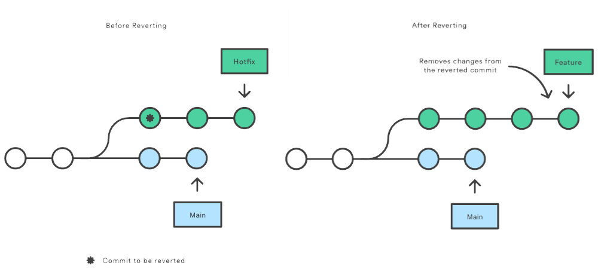
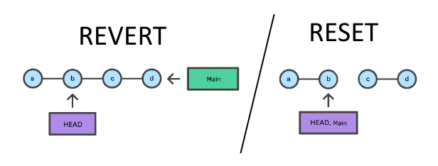
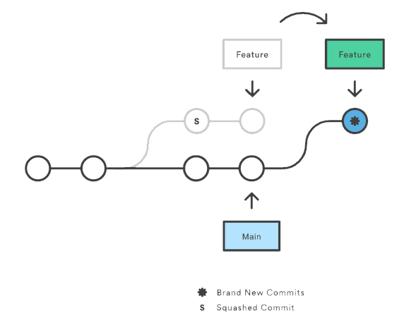
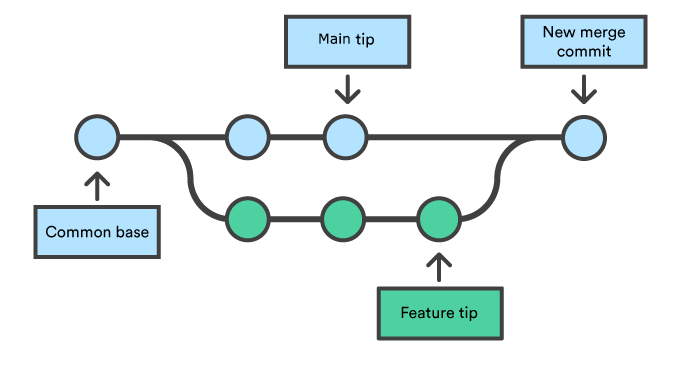
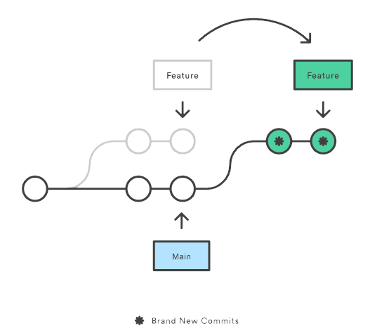
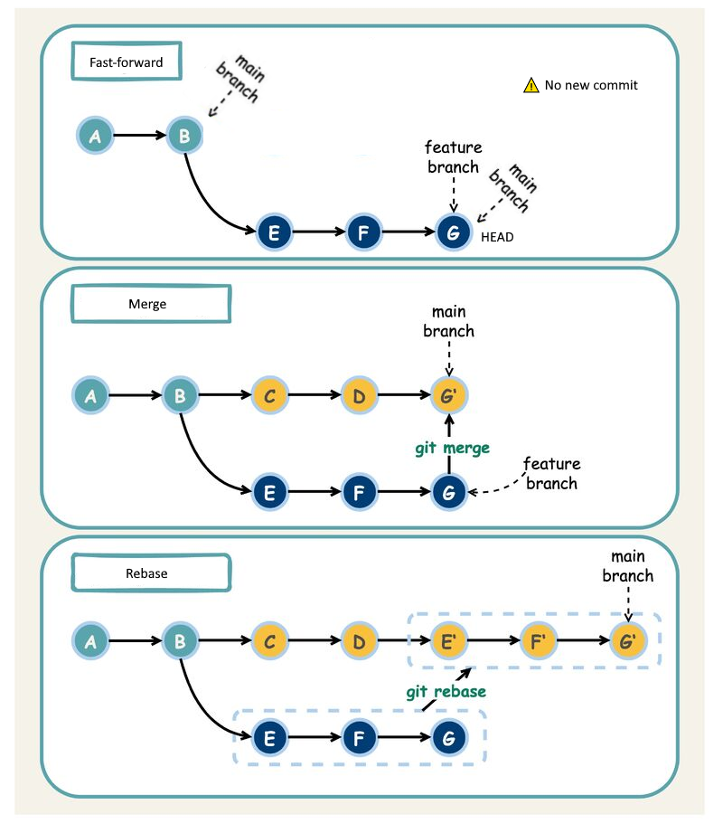

# Git

## Notions

On regroupe ici les notions principales de git

Ici on distingue bien la notion de workspace et de repository :  
- `Repository` : Ce qui est dans le .git  
- `Workspace` : Ce qui est dans le répertoire courant, le contenu du repertoire  
- `Staging index`: procede au suivi des changements du repertoire de travail associé a l'action git add, à stocker dans le commit suivant. C'est une mise en cache   
- `Commit history`: L'ensemble de changements du staging index est ajouté a l'historique des commits lors d'un git commit  

Autres notions:  
- `Tracked branches` : une branche locale representant (connecté à) une branche distante. Elle respecte la convention <remote\>/<branch\>  
- `origin/master` : origin est un alias de l'URL remote et master est la branche locale visée  
- `HEAD` : HEAD correspond par defaut à la branche main et sur le commit le plus récent. Il peut être deplacé grâce à checkout    
- `detach HEAD` : On peut changer le head entre les branches mais aussi changer de commit a ce moment là on est en detach HEAD (on a pas bougé le pointeur HEAD mais revoir des config d'anciens fichiers par ex)  
- `Hash` : Le moyen le plus direct de référencer un commit. Il correspond à un ID unique du commit. Utilise SHA-1  
- `Refs` : Un moyen indirect de réfencer un commit. C'est un alias user-friendly, il correspond à un path .git/refs/heads/some-feature...  
- `Tip` : La pointe d'une branche et correspond au commit le plus récent de celle-ci.  
- `Fast-forward`: Dans le cas d'un git merge si les branches n'ont pas divergées (ex: branch feature qui rebase sur la main juste avant le merge) alors pas de commit supplementaire. La pointe de la branche actuelle pointe vers celle de la branche cible  

## Add

La commande git add ajoute un changement dans le repertoire de travail a la zone de staging

## Commit

La commande git commit snapshot les changements actuellement en stages du projet (via git add)
`git commit --amend`: Permet de modifier le dernier commit soit le message soit en ajoutant des modifications (git add necessaire). Il faudra preciser le --force pour le push (ahead d'un commit)

## Pull & Fetch




Git pull et git fetch nous permettent de mettre a jour le repo local mais en voici la difference principale  
En prenant connaissance des notions ci-dessus on peut deduire que la difference principale entre pull et fetch est que le pull fait **un fetch puis un merge**  
Si on veut pusher ce serait de la facon suivante : `git push <remote> <branch>`, ex: `git push origin master`

## Branches

Pour voir les branches du repo localement : `git branches`  
On peut ajouter l'option -r pour voir les branches distantes

**A savoir les branches ne sont que des pointeurs vers des commits**

## Reset & Revert



La commande git reset est un outil complexe et polyvalent pour annuler les changements.<br>  
git reset devrait generalement etre consideree comme une methode d'annuliation locale   
Ex:   
- `git reset`: Reset de la zone de staging de sorte qu'elle corresponde au commit le plus recent, sans modifier le repertoire de travail  
- `git reset < fichier >`: Supprimez le fichier specifie dans la zone de staging, mais ne modifiez pas le repertoire de travail    
- `git reset --hard a1e8fb5`, l'historique de commit est reinitialise sur ce commit donne en local ! On peut toujours push ensuite mais il faudra faire un --force  
Si aucun commit n'est specifie c'est HEAD qui est implicite  


3 modes pour reset :

- `hard`: La perte de donnees est totale. les pointeurs de la ref d'historique des commits sont mis a jour au commit specifie. L'index de staging et le repertoire de travail sont ensuite reinitialises de sorte qu'ils correspondent a ceux du commit specifie   
- `mixed`: Mode par defaut. Les pointeurs de ref sont mis a jour. L'index de staging est reinitialise a l'etat du commit specifie. Les changements annules depuis l'index de staging sont deplaces vers le repertoire de travail
- `soft`: les pointeurs de ref sont mis a jour et le reset s'arrête. L'index de staging et le repertoire de travail ne sont pas modifies



Si on veut reinitaliser en remote alors on peut utiliser revert car la grande difference entre les deux c'est que **l'historique est garde pour le revert**. On ne supprime pas le commit mais on vient en ajouter un.    




## Stach

La commande git stash prend vos changements non commites (stages et non stages), les enregistre pour une utilisation ulerieure, puis les replace dans votre copie de travail  
`git stach` : Sauvegarde les changements non commites  
`git stach pop`: Reappliquer la sauvegarde a l'espace de travail  

Attention git statch ne prend pas en compte les fichiers non-trackes (nouveaux fichiers et fichiers ignores), il faut utiliser les options -a ou -u pour cela  

## Squash

Squasher des commits signifie regrouper plusieurs commits en un seul


Ex: 
```
git rebase -i HEAD~5 #pick and squash as u want
git push --force origin master
```

## Checkout

Checkout sert a changer de branche. On peut aussi en creer si elles n'existent pas   
On peut creer des branches purement locales :  
`git checkout -b sf`

Ou des tracked branches :  
`git checkout --track origin/sf`

On peut aussi checkout sur un commit `git checkout a1e8fb5` ce qui nous permet de voir l'etat du repo a ce moment la. On peut aussi creer une branche avec un checkout sur un commit ce qui permet "d'annuler" un ou plusieur commit sur une nouvelle branche.

## Merge & Rebase

  
Dans Git, le merge permet de reconstituer un historique forke. La commande git merge vous permet de selectionner les lignes de developpement independantes creees avec git branch et de les integrer a une seule branche.


Rebasage consiste a deplacer vers un nouveau commit de base ou a combiner une sequence de commits. La principale raison du rebasage est de maintenir un historique de projet lineaire  


  
Ex: Situation ou la branche principale a evolue depuis que vous avez commencea travailler sur une branche de fonctionnalite. Vous souhaitez obtenir les dernières mises a jour de la brache principale dans votre branche de fonctionnalite, mais vous souhaitez garder l'historique de votre branche propre de sorte qu'il apparaisse comme si vous aviez travaille dans la branche main la plus recente

Ex: `git rebase main side1 #Permet de fusionner les deux branches et d'avoir le commit side1 en HEAD`

Il est interessant d'utiliser git avec le mode interractif afin de vraiment choisir quoi faire des commit qui seront affectes par le rebase   

La commande git rebase en elle-même n'est pas si dangereuse. Les dangers réels surviennent lors de l'exécution de rebases interactifs de réécriture d'historique et de pushs forcés des résultats vers une branche distante partagée par d'autres utilisateurs. C'est un modèle qui devrait être évité, car il est susceptible d'écraser le travail des autres utilisateurs distants lorsqu'ils font un pull.


## Cherry-pick

git cherry-pick est une commande puissante qui permet de choisir des commits Git arbitraires par référence et de les ajouter au HEAD actuel  
Exemple d'utilisation :  
- Hotfix de bug, pour corriger rapidement un bug on prend un commit d'une branche de dev ou de fonctionnalite et on l'integre directement au HEAD du main  
- Collaboration entre équipes : recupérer une partie précise d'une autre branche (utilisation commune d'un backend par exemple)  


## Merge Strategies



- **Merge commit** (--no-ff) : Always create a new merge commit and update the target branch to it, even if the source branch is already up to date with the target branch.  
- **Fast-forward** (--ff) : If the source branch is out of date with the target branch, create a merge commit. Otherwise, update the target branch to the latest commit on the source branch.  
- **Fast-forward only** (--ff-only) : If the source branch is out of date with the target branch, reject the merge request. Otherwise, update the target branch to the latest commit on the source branch.  
- **Rebase and merge** (rebase + merge --no-ff) : Rebase commits from the source branch onto the target branch, creating a new non-merge commit for each incoming commit, and create a merge commit to update the target branch.  
- **Rebase and fast-forward** (rebase + merge --ff-only) : Rebase commits from the source branch onto the target branch, creating a new non-merge commit for each incoming commit, and fast-forward the target branch with the resulting commits.  
- **Squash** (--squash) : Combine all commits into one new non-merge commit on the target branch.  
- **Squash, fast-forward only** (--squash --ff-only) : If the source branch is out of date with the target branch, reject the merge request. Otherwise, combine all commits into one new non-merge commit on the target branch.  
