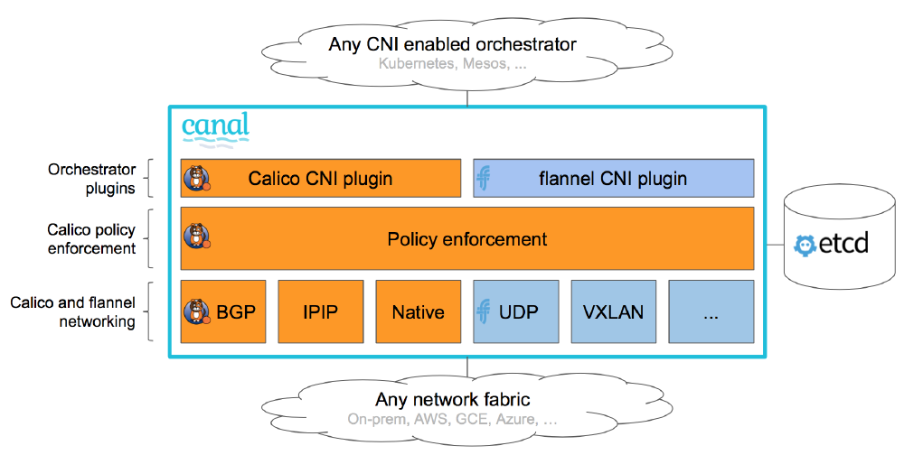
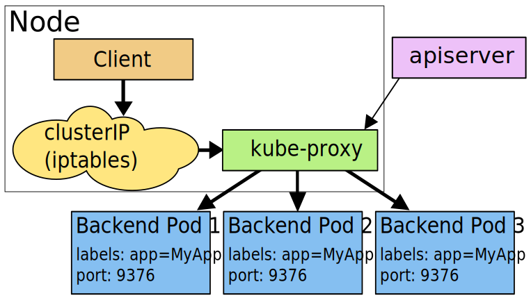
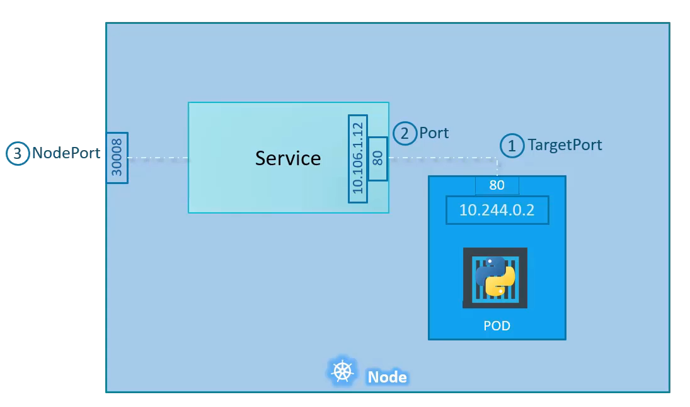

# Kubernetes

## Concept de base

Sert à :

- Orchestrer (type Docker Swarm)
- Plus besoin d'IP, tout est relatif
- Haute Dispo
- Scaling

Mode Cluster (primaire/secondare)

### Notions 

- **Noeud** : Serveurs. Physique ou virtuel
	- Master ou noeud d'excution
- **Pods** : Ensemble de conteneur
	- Un ou plusieurs conteneur
	- Une instance de K8s
- **Service** : Exposition d'une app avec abstraction des pod (gère changement IP etc...)
	- Pas d'IP donc
	- service > ip/port > pods
- **Volume** : Comme docker
	- Persistent / Non persistent
- **Deployment** : Objet de gestion des déploiements
	- Creation/Suppresion
	- Scaling
- **Namespaces** : Cluster virtuel (ensemble de service)
	- Sert à cloisonner dans K8s
	- Pas applicable aux objets englobant le cluster (StorageClass, Nodes, PersistentVolumes etc...)
- **Context**: Donne qui sommes nous, ou sommes nous (conf du namespace)

## Commandes

`kubeadm` : install du cluster  
`kubelet` : service qui tourne sur les machines (lancement pods...)  
`kubectl` : permet la communication avec le cluster  

### Kubectl

- `kubectl create -f <file>`: Créé les objects définis dans le fichier de conf
- `kubectl delete -f <file>`: Supprime les objects définis dans le fichier de conf
- `kubectl replace -f <file>`: Met à jour les objets en remplacant entièrement la config live (attention certains champs sont immutables)
- `kubectl diff -f configs/`: Regarde les différence entre les fichiers de conf dans config et les objets live
- `kubectl apply -f configs/`: Applique les différences, l'APi se charge de set les champs non renseignés
- `kubectl describe node <insert-node-name-here>`: Show status of a node
- `kubectl describe pods/private-image-test-1`: Show status of a node

## Object Spec and Status

Almost every Kubernetes object includes two nested object fields that govern the object's configuration: the object spec and the object status  
The status describes the **current state** of the object  
For objects that have a spec its **desired state**.  
Le but du ControlPlane (plus précisement controller manager) est de faire en sorte que le current state passe en desired state

Ex: d'un déploiement (ligne 2) qui possède une spec

```yaml
apiVersion: apps/v1
kind: Deployment
metadata:
  name: nginx-deployment
spec:
  selector:
    matchLabels:
      app: nginx
  replicas: 2 # tells deployment to run 2 pods matching the template
  template:
    metadata:
      labels:
        app: nginx
    spec:
      containers:
      - name: nginx
        image: nginx:1.14.2
        ports:
        - containerPort: 80
```

Des champs sont mandatory dans le yaml d'un objet Kubernetes

- `apiVersion`: Which version of the Kubernetes API you're using to create this object
- `kind`: What kind of object you want to create
- `metadata`: Data that helps uniquely identify the object, including a name string, UID, and optional namespace
- `spec`: What state you desire for the object

Les `labels` (similaire à un système de tag) servent à filtrer et chercher des objets alors que les `annotations` servent juste à inscrire des informations supplémentaires (pas de recherche dessus)

## Namespace

Kubernetes starts with four initial namespaces:

- `default`: The default namespace for objects with no other namespace
- `kube-system`: The namespace for objects created by the Kubernetes system
- `kube-public`: This namespace is created automatically and is readable by all users (including those not authenticated). This namespace is mostly reserved for cluster usage
- `kube-node-lease`: This namespace holds Lease objects associated with each node. Node leases allow the kubelet to send heartbeats so that the control plane can detect node failure.

## Network

Le réseau est définit via un CNI (Container Network Interface) qui définit lui-même un nombre de prérequis réseau necessaire (ajout d'un namespace, invoquer un plugin bridge etc...)  
Il faut que le provider utilisé (Flannel, Weave, Kalico etc...) respectent les conditions du CNI (ajout d'un namespace, invoquer un plugin bridge etc...)  
Les plugins network sont définit au niveau des kubelet dans un dossier avec les configuration. Ils sont ensuite utilisé par le provider CNI lors de l'invocation des plugins    
Exemple CNI (ici Canal le provider CNI de Rancher):  



### CNI manuel

Pour comprendre comment les pods peuvent communiquer les uns avec les autres voici les étapes manuelles que fait un provider CNI via ses plugins :  
Etapes :  
- Ajout d'un lien de type bridge : `ip link add v-net-0 type bridge`  
- On "démarre" ces liens : `ip link set dev v-net-0 up`  
- On ajoute une ip à ce brige qui servira de gateway : `ip addr add 10.244.1.1/24 dev v-net-0`  
- On créé un lien qui servira à connecter notre pod à notre bridge : `ip link add veth-red type veth peer name veth-red-br`  
- On connecte le lien au pod red (namespace red) : `ip link set veth-red netns red`  
- On connecte le lien au bridge : `ip link set veth-red-br master v-net-0`  
- On attribue une IP au pod : `ip -n red addr add 10.244.1.2/24 dev veth-red`  
- On attribue une route au pod : `ip -n red route add default via 10.244.1.1`  
- On "démarre" ce lien : `ip -n red link set dev veth-red up`  
Dans le cas où il y a plusieurs nodes il faut aussi préciser la route entre les pods :   
- On ajoute la route au niveau du node : `ip route add 10.244.2.2 via 192.168.1.12 #192.168.1.12 est l'ip du noeud`  

### CNI exemple Weave

Un exemple de provider CNI est WeaveWorks. Il a un comportement classique de provider CNI  
Il créé un agent sur chaque node et ils communiquent entre eux, ils échangent ensemble des informations au sujet des réseaux, pods etc...  
Ce qui leur permet d'avoir une topologie précise du cluster   

### Service

Les services (ip exposée interne ou externe) sont accessible depuis tous les noeuds du cluster  
C'est le rôle de kubeproxy lorsqu'un service est créé de créer un rule forwardto iptables (ca peut être userspace ou ipvs plutot que iptables)   

### Istio

Sert à faire du service mesh  
Service mesh : 
- Utilise un side car pour faire passer le traffic inbound/outbound et gérer le TLS (et mTLS), observabilité et traffic control (qui peut parler à qui)  
- couteux --> un proxy container par pod pour ça + increase startup time (+1 container) + upgrading the mesh est complexe par l'application dépend directement de cela (control plane upgrade puis data plane)
Ambiant Mesh : 
- Comme le service mesh mais au lieu d'un proxy container par pod c'est un proxy par node (plus rapide, upgrade facilité par seulement un rollout du pod en question  )
- Fait du L4 avec ztunnel --> mTLS, Authentication, Autorization --> 0 trust
- Peut faire du L7 aussi avec Waypoint proxy --> request routing, automatic retries


## Composants


services-userspace-overview.svg

### Composants master (Control Plane)

- `kube-apiserver`:  Composant sur le master qui expose l'API Kubernetes. Est controllé par kubectl (qui ne fait q'envoyer des curl auprès d'etcd  
- `etcd`:  Base de données clé-valeur consistante et hautement disponible utilisée comme mémoire de sauvegarde pour toutes les données du cluster (nodes, pods, configs, secrets etc...).  
- `kube-scheduler`:  Composant sur le master qui surveille les pods nouvellement créés qui ne sont pas assignés à un nœud et sélectionne un nœud sur lequel ils vont s'exécuter.  
- `kube-controller-manager`:  Composant du master qui exécute les contrôleurs (surveille l'état du cluster et effectue des changements pour passer du current state vers le desired state)  
  - `node-controller`: Verifie l'état d'un node toute les 5s. Si NOK attend 40s pour confirmer. Si au bout de 5mn toujours pas UP alors il supprimer les pods du node et les provisionne autre part  
  - `replication-controller`: Vérifie que le nombre de pods désire correspond bien au nombre actuel  
- `cloud-controller-manager`:  A Kubernetes control plane component that embeds cloud-specific control logic. The cloud controller manager lets you link your cluster into your cloud provider's API  

`scheduler` : Il utilise deux phases pour identifier le meilleur node pour un pod
- 1ère phase: il élimine les nodes qui n'ont pas les ressources suffisantes (RAM, CPU etc...) pour accueuillir le pod  
- 2eme phase : il rank les nodes selon certains critères (ressources par ex) et choisi le meilleur 

Si plusieurs master dans le cluster :  
- Il est courant que `etcd` soit externalisé (+ de setup, - de risque)  
- Le scheduler et le controller manager sont en actif/passif et un election a lieu régulièrement pour savoir quel master garde ces roles  
- APIServer est en actif/actif, on peut mettre un reverse proxy devant si besoin  
- `ETCD` en HA a également un process d'election et si un worker doit écrire il transfère celle-ci au master qui après avoir écrit replique celle-ci sur les autres workers.  

### Composants noeud (Node)

- `kubelet` : An agent that runs on each node in the cluster. It makes sure that containers are running in a Pod.  
- `kube-proxy` : kube-proxy is a network proxy that runs on each node in your cluster, implementing part of the Kubernetes Service concept.a kube-proxy maintains network rules on nodes. These network rules allow network communication to your Pods from network sessions inside or outside of your cluster.  

  - kube-proxy can be in IPVS mode which is a better more scalable than iptables (kube-proxy is build on it), iptables at some point take lot of CPU to handle 5000+ rules. IPVS is built on top of the Netfilter and implements transport-layer load balancing as part of the Linux kernel. Can be configured by setting `--proxy-mode=ipvs` in kubeproxy config  


## Workloads

Un workload (charge de travail) est une application fonctionnant sur Kubernetes. Que votre workload soit un composant unique ou un agrégat de composants, sur Kubernetes celui-ci fonctionnera dans une série de pods  
Plusieurs ressource de workload :   
- `Deployment`: Deployment is a good fit for managing a stateless application workload on your cluster (representation logique d'un ou plusieurs pods)   
- `ReplicaSet`: A ReplicaSet's purpose is to maintain a stable set of replica Pods running at any given time. Préférer le Deployment, à ne pas confondre avec du scaling (nombre d'instance fixe).   
- `StatefulSet`: One or more related Pods that do track state somehow. For example, if your workload records data persistently, you can run a StatefulSet that matches each Pod with a PersistentVolume. Peut se repliquer avec d'autres pod pour + de résilience  
- `DaemonSet`: Defines Pods that provide node-local facilities (kube réseau par ex, pour le fonctionnement du system kube)  
- `Job & CronJob`: Define tasks that run to completion and then stop.  


### ReplicaSet

HPA vs VPA (Horizontal vs Vertical). Horizontal ajoute des pods (grace au ReplicaSet), vertical ajoute des ressources RAM CPU. Pod > ReplicaSet > HPA > deploy
Pas de HPA sans métriques  

```yml
apiVersion: autoscaling/v1
kind: HorizontalPodAutoscaler
metadata:
  name: monhpa
spec:
  scaleTargetRef:
    apiVersion: extensions/v1beta1
    kind: Deployment
    name: monfront
  minReplicas: 3
  maxReplicas: 10
  targetCPUUtilizationPercentage: 11
```

### StatefulSet

Pour des app stateful (type BDD)  
Problématique lorsqu'on a une BDD sur plusieurs conteneurs :  
- Le stockage presistant  
- La communication entre les noeuds (assurer la distribution)  
- L'initialisation des noeuds  

Particularité du StatefulSet:  
- Ordonnées (dans le lancement)  
- Garde en mémoire les volumes attachés  
- Précise un PV et créé tout seul les PVC  
- On peut y coupler un `Service` afin de faire du headless (round robinDNS)  

### DaeonSet

Ressemble beaucoup aux replica set mais n'execute qu'une seule copie du pod sur **chaque** node  
Utilisé pour log collector ou monitoring mais surtout networking  

## Pods & Containers

Le Pods correspond à une IP et des ports. S'il y'a plusieus conteneurs ils partagent les IP et les ports !

- `Static Pods`: Managed directly by the kubelet daemon on a specific node, without the API server observing them. The main use for static Pods is to run a self-hosted control plane: in other words, using the kubelet to supervise the individual control plane components
- `Container probes`: A probe is a diagnostic performed periodically by the kubelet on a container. To perform a diagnostic, the kubelet can invoke different actions:
     - ExecAction (performed with the help of the container runtime)
     - TCPSocketAction (checked directly by the kubelet)
     - HTTPGetAction (checked directly by the kubelet)
- `Init containers`: There are run before the app containers are started. Each init container must complete successfully before the next one starts. Ex:
``` yml
apiVersion: v1
kind: Pod
metadata:
  name: myapp-pod
  labels:
    app: myapp
spec:
  containers:
  - name: myapp-container
    image: busybox:1.28
    command: ['sh', '-c', 'echo The app is running! && sleep 3600']
  initContainers:
  - name: init-myservice
    image: busybox:1.28
    command: ['sh', '-c', "until nslookup myservice.$(cat /var/run/secrets/kubernetes.io/serviceaccount/namespace).svc.cluster.local; do echo waiting for myservice; sleep 2; done"]
  - name: init-mydb
    image: busybox:1.28
    command: ['sh', '-c', "until nslookup mydb.$(cat /var/run/secrets/kubernetes.io/serviceaccount/namespace).svc.cluster.local; do echo waiting for mydb; sleep 2; done"]
```

### Ressources

2 cas :  
- `requests`: minimum par conteneur (important pour le scheduler)  
- `limits`: ressource max par pod (important pour la santé)  
2 types :  
- `CPU`  
- `RAM`  
  
Ressource `LimitRange` : valeur par defaut pour les limits  


## ConfigMap et Secret

Env : Variable d'environnement spécifiée dans le manifest
ConfigMap : Centraliser améliorer et faciliter la gestion des configuration  
Secrets : C'est un ConfigMap avec encoding base64, peuvent être manipulé via manifeste
Outil similaire : Consul (conf), Vault (secret)  

Ex:

```bash 
kubectl create configmap langue --from-literal=LANGUAGE=Fr
```

```bash 
kubectl create secret generic mysql-password --from-literal=MYSQL_PASSWORD=monmotdepasse
```

On peut aussi donner ces config via un fichier de conf (--from-file). Peuvent être editer via edit en CLI ou manifeste 
 via replace 
Ex via manifeste : 

```yml
kind: ConfigMap 
apiVersion: v1 
metadata:
  name: personne
data:
  nom: Xavier 
  passion: blogging
  clef: |
 
    age.key=40 
    taille.key=180
```

Utilisation ex:  

```yml
apiVersion: v1
kind: Pod
metadata:
  name: monpod
spec:
  containers:
    - name: test-container
      image: k8s.gcr.io/busybox
      command: [ "/bin/sh", "-c", "env" ]
      env:
        - name: NOM
          valueFrom:
            configMapKeyRef:
              name: personne
              key: nom
        - name: PASSION
          valueFrom:
            configMapKeyRef:
              name: personne
              key: passion
```
ou alors toute la config map  
```yml
      envFrom:
        - configMapRef:
            name: personne
```

## Service

In Kubernetes, a Service is an abstraction which defines a logical set of Pods and a policy by which to access them (sometimes this pattern is called a micro-service). En gros un moyen d'accéder à nos pods (ip/port)
Ex: This specification creates a new Service object named "my-service", which targets TCP port 9376 on any Pod with the app=MyApp label.
```yml
apiVersion: v1
kind: Service
metadata:
  name: my-service
spec:
  selector:
    app: MyApp
  ports:
    - protocol: TCP
      port: 80
      targetPort: 9376
```



- `Port` expose le service Kubernetes sur le port spécifié dans le cluster. Les autres pods du cluster peuvent communiquer avec ce serveur sur le port spécifié
- `TargetPort` est le port sur lequel le service enverra les requêtes, sur lequel votre pod écoutera. Votre application dans le conteneur devra également écouter sur ce port.
- `NodePort` expose un service en externe au cluster au moyen de l'adresse IP des noeuds cibles et du NodePort. NodePort est le paramètre par défaut si le champ du port n'est pas spécifié.


Pour exposer un service 3 types sont possibles :  
- `ClusterIP`: Exposition mais interne uniquement  
- `NodePort`: Rendre public un un pod via un port  
- `LoadBalancer`: Expose via un controller ingress ou dans le cloud  
- `ExternalName`: Via une URL  

## Ingress

Ingress est l'équivalent d'un reverse proxy, il va router le flux vers différents services selon l'URL demandée et le path.  
Il va ensuite faire tout ce que fait un reverse proxy : SSL, rewrite etc...  
Il necessite de :  
- Deployer un `Ingress Controller` (haproxy, nginx, traefik etc...)  
- Configurer à l'aide d'`Ingress ressources`   

Ex : Créer un deployment ingress-controller avec un configmap pour la conf puis un service pour l'exposer (nodeport). Il necessite aussi un service account     

Ensuite il faut faire la configuration (ingress ressource). Attention un Ingress redirige toujours **vers un ou des services et non des pods**  
C'est à ce moment là qu'on peut créér un kind=ingress  

Ex: 
```
apiVersion: networking.k8s.io/v1
kind: Ingress
metadata:
  name: minimal-ingress
  annotations:
    nginx.ingress.kubernetes.io/rewrite-target: /
spec:
  ingressClassName: nginx-example
  rules:
  - http:
      paths:
      - path: /testpath
        pathType: Prefix
        backend:
          service:
            name: test
            port:
              number: 80
      - path: /web
        pathType: Prefix
        backend:
          service:
            name: web
            port:
              number: 80
```

## Probes

Quelques type de sondes possible (exhaustivement):   
- `livenessProbe`: Indicates whether the container is running. If the liveness probe fails, the kubelet kills the container, and the container is subjected to its restart policy  
- `readinessProbe`: Indicates whether the container is ready to respond to requests. If the readiness probe fails, the endpoints controller removes the Pod's IP address from the endpoints of all Services that match the Pod. (ne le redémarre pas, le sort juste du pool)  
- `startupProbe`: Indicates whether the application within the container is started. All other probes are disabled if a startup probe is provided, until it succeeds. If the startup probe fails, the kubelet kills the container, and the container is subjected to its restart policy   

Si readiness + liveness alors recreation du conteneur si double fail

Variables de probes : 

- `initialDelaySeconds`: Nombre de secondes après le démarrage du conteneur avant que les liveness et readiness probes ne soient lancées.  
- `periodSeconds`: La fréquence (en secondes) à laquelle la probe doit être effectuée.  
- `timeoutSeconds`: Nombre de secondes après lequel la probe time out.   
- `successThreshold: Le minimum de succès consécutifs pour que la probe soit considérée comme réussie après avoir échoué.  
- `failureThreshold`: Quand un Pod démarre et que la probe échoue, Kubernetes va tenter failureThreshold fois avant d'abandonner.   


## Deployment

Deployment is an object that can represent an application running on your cluster  
Se base sur des ReplicaSet, attention après chaque upgrade des Deployments les ReplicaSet associés ne sont pas clean (history 10), cela permet de faire le rollback  
Très intéréssant :   
- Englobe les fonctionnalités des pods et des replica set  
- Permet de faire des montée de verions : progressivité, itérations (MAJ), stratégie  
- Rollbacks possible si problèmes  
- Versionning des déploiements  

4 types de déploiements (deux derniers addons):  
- `RollingUpdate` (default):  
  - Creation d'un nouveau pod 2.0  
  - Intégration de v2.0 dans le pool si conforme (probes)  
  - Supression d'un pod v1.0  
- `Recretae`:  
  - Plus violent  
  - Supression des v1.0  
  - Creation des v2.0  
- `Blue/Green`: Cohéxistence des 2 versions pour test  
- `Canary deployment` Cohéxistence des 2 mais migration progressive des requêtes (10/90 par ex)  

Ex: 

```yml
apiVersion: apps/v1
kind: Deployment
metadata:
  name: myfirstdeploy
  namespace: default
spec:
  replicas: 5
  selector:
    matchLabels:
      app: monfront
  template:
    metadata:
      labels:
        app: monfront
    spec:
      containers:
      - image: nginx:1.16      # suivante 1.17
        imagePullPolicy: Always
        name: podfront
        ports:
        - containerPort: 80
        readinessProbe:
          httpGet:
             path: /
             port: 80
          initialDelaySeconds: 5
          periodSeconds: 5
          successThreshold: 1
```
Si upgrade de version de nginx 1.16 en 1.17 un simple apply avec la version changée suffit (car statégie rolling update), 0 paquet perdu !!  
Si besoin de voir le status:  
`kubectl rollout status deployment myfirstdeploy`  
Si besoin d'avoir un historique :  
`kubectl rollout history deployment myfirstdeploy`  
Si besoin de faire un rollback :  
`kubectl rollout undo deploy myfirstdeploy --revision=1`  

## Taints and Tolerations

Taint est un repulsif sur un node qui empeche les pods de venir s'executer dessus  
Tolerations est une autorisation qui s'applique aux **pods** et permet de s'excuter sur des nodes "taint"    

Ex: 
```
kubectl taint node node01 spray=mortein:NoSchedule #On ajoute le taint spray avec le valeur mortain qui fait NoSchedule
```
Pour ajouter des tolerations sur les pods il faut passer par un manifest  

## Affinity

Pour être sur qu'un pod aille sur un noeud on peut utiliser plusieurs techniques :   
- `NodeSelector`: On match un label donné à un node dans notre manifest dans la section nodeSelector  
- `Affinity`: fait la même chose que le nodeSelector mais beaucoup plus complet et avec plus de complexité   

Plusieurs méthodes sont possibles :  
-`requiredDuringSchedulingIgnoredDuringExecution` : Obligatoire de placer sur ce node mais ignoré lors de l'exécution du pod. Ce qui fait que si on change le label du node les pods exécutés ne bougent pas.  
-`preferredDuringSchedulingIgnoredDuringExecution` : On cherche a placer sur ce node mais si pas possible on en trouve un autre. Ignoré lors de l'éxcution  
-`requiredDuringSchedulingRequiredDuringExecution` : Obligatoire à l'exécution et au scheduling  

** En résumé les taints sont plutôt dédié à empecher des pods à venir s'éxécuter et les affinité à attirer les pods pour venir s'exécuter**  

## PodDisruptionBudget (PDB)  

Sert à garantir le nombre de pod up pendant une "disruption" volontaire (drain, delete pod etc..)  
Par example set le PDB à 3 minAvailable et mettre un deployment à 3 replicas menera à l'impossibilité de drain un noeud s'il y a un pod de ce deployment présent dessus  

## Storage

`CSI` : Container Storage Interface. Permet de s'implementer avec n'importe quel vendeur qui a un plugin supporté  
Ils doivent respecter un certains nombre de RPC (Remote procedure calls) comme provisionner un nouveau volume, décomissioner un volumer etc...  
Exemple de provider CSI: Amazon EBS, GlusterFS, Nutanix etc...  

4 type (mais non exhaustif):
- `emptyDir` : pas de persistance mais partage entre les pods/conteneur (espace partagé)  
- `hostPath`: rep partagé avec le host qui héberge le pod (attention au deplacement entre node)  
- `externe` : ex NFS, glusterFS, VSphere etc...  
- `PersistentVolumeClaim (PVC)`: Requete de stockage, c'est comme un pod  
  
### PersistentVolume

Notion `PersistentVolume (PV)`: Une ressource de stockage comme un noeud ou une ressource de cluster  
Séparation entre provisionning et consommation (PV et PVC)  
Imbrication :  
- PV > PVC > Pods  
- Provisionning > quota pods > utilisation pods  

Provisioning:  
`Static`: On précise le vrai stockage et créé manuellement    
`Dynamic`: Lorsqu'aucun static PV match un PVC alors creation auto d'un PV (basé sur une storage class)    

### StorageClass

A StorageClass decrit comment le stockage devrait être avec un backend (Google cloud engine, AmazonEBS, GlusterFS etc...)  
Interêt :  
- Cela permet notamment de faire du provionnement automatique via celle-ci sur le provider (dynamic provionning)  
- On a plus besoin de créér manuellement des PV (ils sont quand même créé)  
- On peut créer plusieurs classes selon le provider (GCE : sc-silver pour les HDD classiques GCE, sc-gold pour les SSD GCE etc...)  


Ex : ici une classe aws-ebs

```yml
apiVersion: storage.k8s.io/v1
kind: StorageClass
metadata:
  name: standard
provisioner: kubernetes.io/aws-ebs
parameters:
  type: gp2
reclaimPolicy: Retain
allowVolumeExpansion: true
mountOptions:
  - debug
volumeBindingMode: Immediate
```

### PV

Mode d'accès :

- `ReadWriteOnce` -- le volume peut être monté en lecture-écriture par un seul nœud
- `ReadOnlyMany` -- le volume peut être monté en lecture seule par plusieurs nœuds
- `ReadWriteMany` -- le volume peut être monté en lecture-écriture par de nombreux nœuds

Les politiques de récupération actuelles sont:

- `Retain` - Volume conservé mais versioné
- `Recycle` - On ne le perd pas mais il est vidé (deprecated au profit de dynamic provisioning)
- `Delete` -- (Default)  This means that a dynamically provisioned volume is automatically deleted when a user deletes the corresponding PersistentVolumeClaim (Suppression du PVC = suppression du PV)

A volume will be in one of the following phases:

- `Available` -- a free resource that is not yet bound to a claim
- `Bound` -- the volume is bound to a claim
- `Released` -- the claim has been deleted, but the resource is not yet reclaimed by the cluster
- `Failed` -- the volume has failed its automatic reclamation

EX : 

```yml
apiVersion: v1
kind: PersistentVolume
metadata:
  name: pv0003
spec:
  capacity:
    storage: 5Gi
  volumeMode: Filesystem
  accessModes:
    - ReadWriteOnce
  persistentVolumeReclaimPolicy: Recycle
  storageClassName: slow
  mountOptions:
    - hard
    - nfsvers=4.1
  nfs:
    path: /tmp
    server: 172.17.0.2
```


### PVC

Resources: Claims, like Pods, can request specific quantities of a resource


Ex: 

```yml
apiVersion: v1
kind: PersistentVolumeClaim
metadata:
  name: myclaim
spec:
  accessModes:
    - ReadWriteOnce
  volumeMode: Filesystem
  resources:
    requests:
      storage: 8Gi
  storageClassName: slow
  selector:
    matchLabels:
      release: "stable"
    matchExpressions:
      - {key: environment, operator: In, values: [dev]}
```

Ex: Claim from a pod

```yml
apiVersion: v1
kind: Pod
metadata:
  name: mypod
spec:
  containers:
    - name: myfrontend
      image: nginx
      volumeMounts:
      - mountPath: "/var/www/html"
        name: mypd
  volumes:
    - name: mypd
      persistentVolumeClaim:
        claimName: myclaim
```

## Monitoring & logging

On peut utiliser la commande `kubectl top node`ou `kubectl top pods` pour voir les stats des pods/ des nodes  
On peut utiliser la commande `kubectl log -f <pod_name> <container_name> #Si plusieurs containers dans le pod`  

## Cluster k8s action

### Maintenance  

En cas de down d'un noeud :   
- Par defaut le noeud va attendre 5min que le node soit up de nouveau  
- Si toujours down alors il reprovisionne les pods des replicas set sur d'autres noeuds  

En cas de maintenance d'un noeud (upgrade, security patch etc...) alors on peut `drain` les noeuds, ce qui permit d'arreter les pods du noeud pour les scheduler sur les autres noeuds. Cela permet aussi de noter le node `Unschedulable`   
Il faut ensuite le `uncordon` pour qu'il puisse de nouveau recevoir des pods. Attention il ne remet pas les pods déplacé sur leur noeud d'origine.   
`Cordon` permet de marque le noeud comme `Unschedulable`  

### Upgrade

Règles de version:  
- Par défaut tous les composants k8s sont à la même version, cela ne prend pas en compte etcd ou coreDNS qui sont des projets externes    
- Le composant de référence est apiserver (version X)  
- Les autres composants ne peuvent pas être supérieur à apiserver (controller-manager, kubelet, scheduler etc...)  
- Les composants serveur peuvent être à X-1 max  
- Les composants agent (kubelet, kube-proxy par ex) peuvent être à X-2 max  
- Kubectl peut être entre X+1 et X-1
- K8s supporte les 3 versions les plus récentes donc il faut toujours être dans celles-ci  
- Il ne faut pas sauter les versions il faut upgrade version par version  

Strategy d'upgrade :
- Downtime du master puis downtime de tous les noeuds pour upgrade (coupure...)  
- Upgrade du master (coupure backend si un seul master) puis rolling update des noeuds (pas de coupure)   
- Ajout de nouveaux noeuds avec la nouvelle version, migration puis suppression des anciens noeuds (bien pour le cloud) 

`kubeadm upgrade plan`pour prévoir la migration

### Backup & Restore

Quelques good practises pour le backup :   

- Utiliser le mode déclaratif avec un repo comme GitHub  
- `kubectl get all --all-namespace -o yaml > all-deploy-services.yaml` --> pour stocker l'ensemble des ressources du cluster   
- Solution externe type VELERO  
- On peut sauvegarder la base ETCD qui est dans un path précis du masteri, on peut aussi configurer des snapshots avec etcdctl  

## Security

Tous les composants k8s communiquent avec des certificats. Ils peuvent être retrouvés dans `/etc/kubernetes/pki` et ils sont configurés dans les différents yaml de `/etc/kubernetes/manifests`   

kubeapiserver authentifie l'utilisateur avant utilisation de celui-ci, il peut utiliser les méchanisme suivants :  
- Fichier de password statique (deprecated)  
- Fichier de token statique  
- Certificats  
- Third authentication (LDAP, Kerberos etc...)  

On peut créér des certificats users avec kubectl  

Plusieurs méthodes pour gérer les droits :  
- Node: si membre du groupe system:node alors on peut request kubelet grâce à Node Authorizer  
- ABAC: atribbutes definition, delaissé au profit des RBAC (plus flexible)  
- RBAC: Rules RBAC  
- WEBHOOK : Third party, ex: Open Policy agent  

### RBAC

On peut faire des RBAC rules pour gérer les permissions dans le cluster  
Ex :  
```
apiVersion: rbac.authorization.k8s.io/v1
kind: Role
metadata:
  namespace: default
  name: pod-reader
rules:
- apiGroups: [""] # "" indicates the core API group
  resources: ["pods"]
  verbs: ["get", "watch", "list"]
```  
Et le binding:  
```
apiVersion: rbac.authorization.k8s.io/v1
# This role binding allows "jane" to read pods in the "default" namespace.
# You need to already have a Role named "pod-reader" in that namespace.
kind: RoleBinding
metadata:
  name: read-pods
  namespace: default
subjects:
# You can specify more than one "subject"
- kind: User
  name: jane # "name" is case sensitive
  apiGroup: rbac.authorization.k8s.io
roleRef:
  # "roleRef" specifies the binding to a Role / ClusterRole
  kind: Role #this must be Role or ClusterRole
  name: pod-reader # this must match the name of the Role or ClusterRole you wish to bind to
  apiGroup: rbac.authorization.k8s.io
```
Les cluster role bindings est exactement pareil que les roles bindings mais en s'affranchissant de la notion de **namespace**  
Pour checker une permission : `kubectl auth can-i create deployments --as dev-user`  

### Service accounts

Sert pour les bots, API etc... (ex: Prometheus, Jenkins etc..)  
Il existe un service account `default` qui est monté par défaut dans tous les pods et qui est très restrictif  

### Image security

A l'instar de docker login lorsqu'on souhaite accéder à un repo privé il faut créér un secret et l'assigner au pod dans la section ìmagePullSecrets`  

### Network policies

On peut faire du firewalling au niveau de k8s, avec des policy de type `Ingress` (entrante) ou `Egress` (sortante)  
Il suffit ensuite de faire des match avec des labels et des selectors   
Attention la plupart des network providers supportent cela mais pas Flannel  
On peut définir des pods ayant droits, des namespaces entier ou même des objects externes (IP, DNS etc...) au cluster. Et tout cela avec des or/and.  

## Minikube

- Version portable
- Moins de ressources et un cluster sur un seul noeud
- Install voir site kubernetes section minikube
- Demarrer le minikube : `minikube start`

## Kubespray

Permet l'installation d'un cluster K8s.
Particularité : 
- Multiprovider : onprem, openstack, cloud etc...
- Automatisation via Ansible
- Assertions (pre-check)
- Configuation très souple (choix du CR)
- Choix du nombre de nodes et du role de chacun des nodes
- Dashboard
- Ingress controller
- Certificats etc...

Intégre Vagrant pour les test  
On peut y coupler un haproxy + keeaplived  

## Rancher

- Provisionner des clusters : cloud à on premise  
- Importer des clusters pour les managers  
- Monitoring + alerting (prometheus + graphana)  
- Roles + users  
- Mise à jour de cluster + rollback  
- Très facile d'installation  

## k3s

- Consomme beaucoup moins de ressources
- Developpé par rancher
- Utilise par défaut containerd


Voir Polaris


## Tips certif

Copier coller difficile, aon peut faire un dry-run pour générer le yaml pour nous : 
kubectl run nginx --image=nginx --dry-run=client -o yaml

Impossible d'édit un pod sur ses attributs sauf les suivants :  
- spec.containers[*].image  
- spec.initContainers[*].image  
- spec.activeDeadlineSeconds  
- spec.tolerations  

Un deploiment lui en revanche peut être editer sans problème sur sa partie déploiement  
