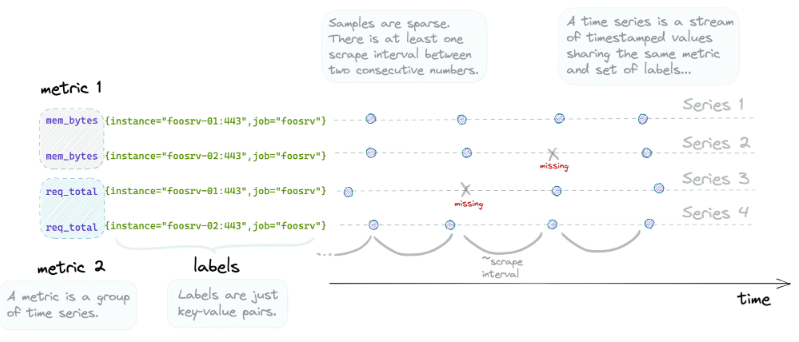
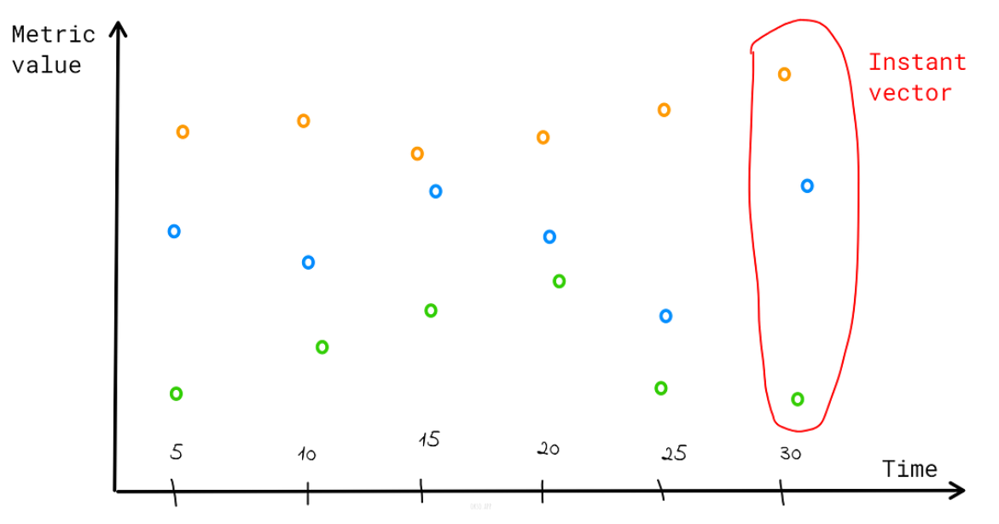
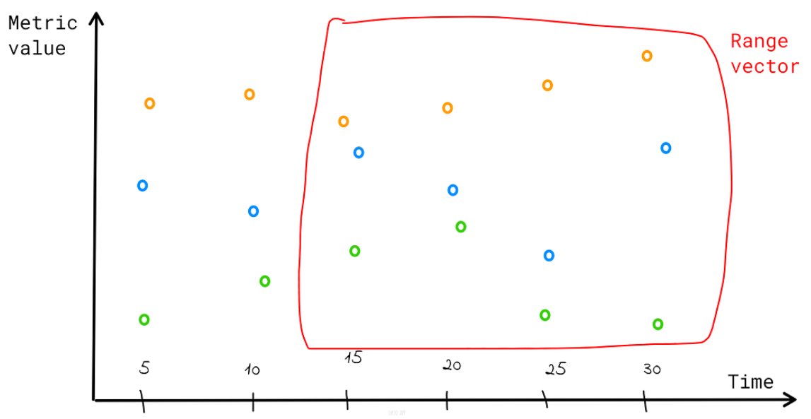
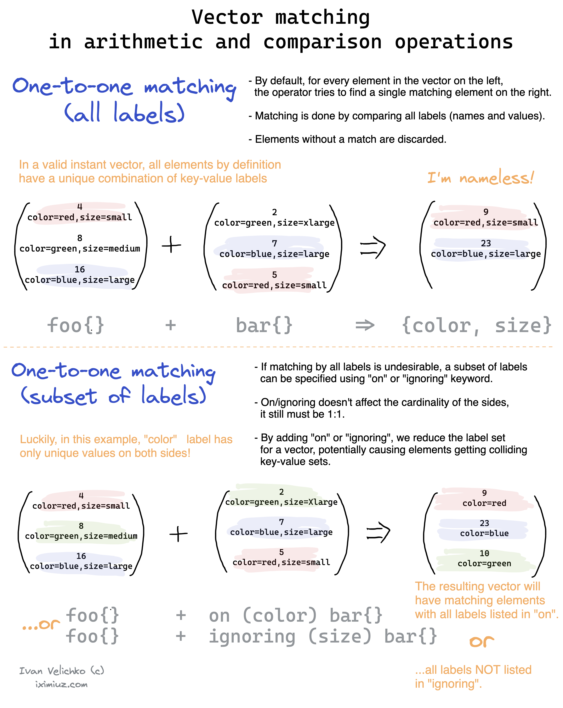
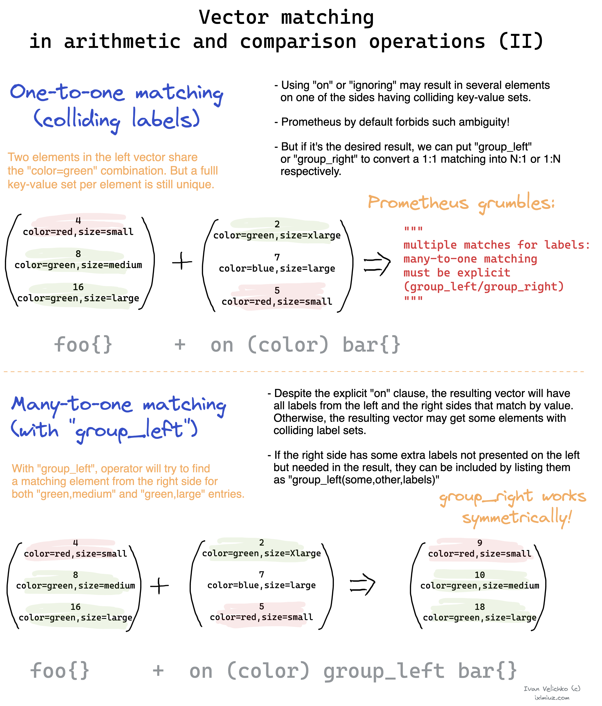
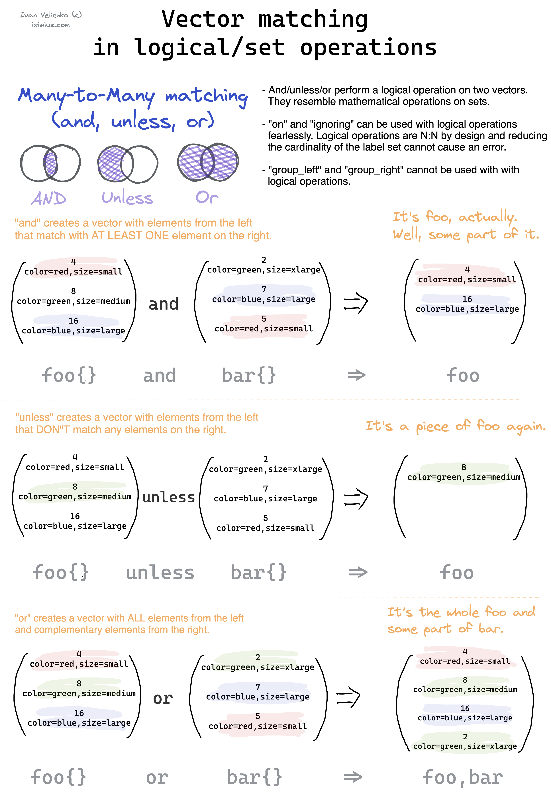
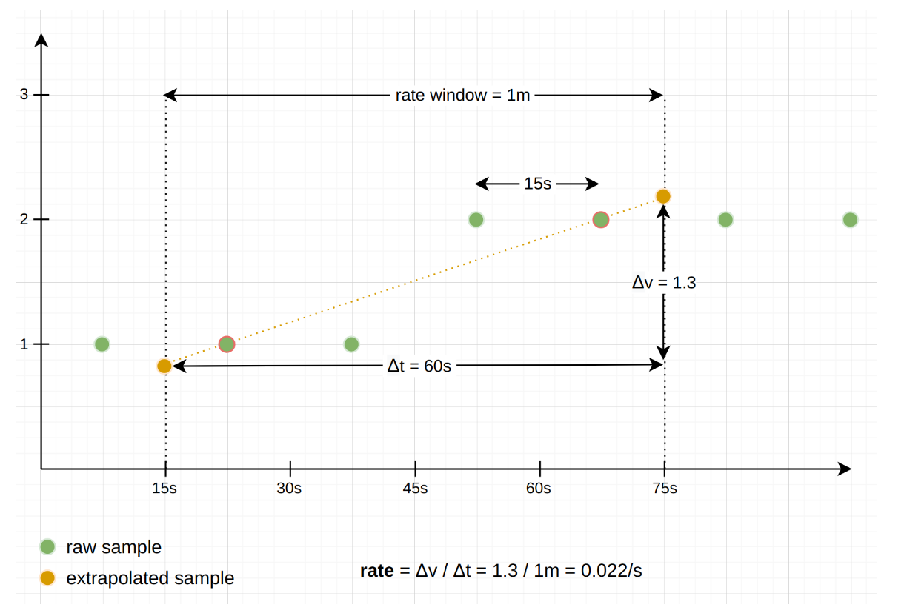

# Prometheus

Service de requetes sur des exporters pour fournir des données à du monitoring (Grafana par ex)
Cheat sheet PromSQL : https://promlabs.com/promql-cheat-sheet/

# Jargon

Il faut bien connaitre les terme utilisé par Prometheus afin de faire les bonnes requêtes : 

### Timeseries
Chaque donnée contient un timestamp, la relation entre un timestamp et une donnée est une timeserie  



### Scalar
Un simple float sans notion de timestamp

### Vector
Un ensemble de timeseries est un vecteur  
Ex : http_requests_total est un vecteur représentant le nombre total de requetes http recu par un serveur. Il fait référence à un ensemble de timeseries nommé http_request_total

### Instant vector
Un set de timeseries ou chaque timestamp pointe sur une seule donnée  
Ex: http_requests_total va renvoyer la valeur la plus à jour (latest) pour chaque donnée
`prometheus_http_requests_total{code="200", handler="/-/ready", instance="prometheus:9090", job="prometheus"} 24997`



### Range vector
Un set de timeseries ou chaque timestamp pointe sur une range de données sur une durée donnée
Ex : http_requests_total[30s]



### Difference

Le range vector ne peut pas être graphé par défaut sauf si on lui donne une fonction qui transforme le range vector en instant vector.  
Par ex : `rate(prometheus_http_requests_total[3m])`  

# Operator

## One to one vector match

Les opérations de vecteur cherchent à matcher des vecteurs entre le côté gauche et droit de l'opération  
Sert à récupérer une paire unique d'entrée de chaque côté de l'opération. Elles ne matchent que si elles ont l'exact même set de labels et valeurs correcpondantes

```
<vector1> <operator> <vector2>
<vector expr> <bin-op> ignoring(<label list>) <vector expr>
```

Example : 


Input : 
```
method_code:http_errors:rate5m{method="get", code="500"}  24
method_code:http_errors:rate5m{method="get", code="404"}  30
method_code:http_errors:rate5m{method="put", code="501"}  3
method_code:http_errors:rate5m{method="post", code="500"} 6
method_code:http_errors:rate5m{method="post", code="404"} 21

method:http_requests:rate5m{method="get"}  600
method:http_requests:rate5m{method="del"}  34
method:http_requests:rate5m{method="post"} 120
```

Query : 
```
method_code:http_errors:rate5m{code="500"} / ignoring(code) method:http_requests:rate5m
```

**Cela permet de recupérer le taux d'erreurs 500 sur le total de requetes http reçu. On ignore le label code pour que l'opération vectorielle soit possible**  
Result : 
```
{method="get"}  0.04            //  24 / 600
{method="post"} 0.05            //   6 / 120
```

On peut faire la même chose avec on pour filtrer sur un ou plusieurs label




##Many-to-one and one-to-many vector match

C'est ma même chose que les one to one il faut que les deux côtés de l'opérations aient les même labels (or ou ignore).  
Par contre pour les resultats de métrique ont pu en inclure plus en précisant **group_left() ou group_right()**  
Il permet d'indiquer les labels qu'on souhaite récupérer pour les resultats (ceux de gauche ou de droite), on peut les préciser entre les parenthèses sinon il prend tout par défaut.  

  

## And/Or/Unless

Pour faire des conditions (if)

Example : 
```
kube_pod_container_resource_requests_memory_bytes{job="kube-state-metrics", node=~"ose3"} and on(pod) kube_pod_status_phase{phase=~"Pending|Running", group="cop-c"} == 1
```

Sert à calculer les requests de tous les pods qui sont en pending ou running (on match les éléments grace au label pod)

Or fait un ou et unless prend toutes les requetes sauf si elles apparaissent de l'autre côté



# Type metric

## Counter

Cumulatif, ne peut qu'increase. Peut reset (restart service par ex).Ex: http_total_request  
Utile avec rate, irate, increase pour avoir une moyenne  

## Gauge

Varie (up and down). Peut être graphé nativement. Ex: temperature  

## Sumary

Utile pour tracker la distribution de valeurs. C'est là qu'on utiliser les percentile ou quantile, fonctionne par bucket  
Par exemple 99,90,50th percentile --> agregge les requetes dans chacun de ces buckett.  
Ex : 
- http_request_duration_seconds{quantile=0.5: 0.01} (combien de secondes pour valeur<=50% des requetes)  
- http_request_duration_seconds{quantile=90: 0.51} (combien de secondes pour valeur<=90% des requetes)  
- http_request_duration_seconds{quantile=99: 2.37} (combien de secondes pour valeur<=99% des requetes)  
- http_request_duration_seconds_sum  88364.234 (représente le temps total de toutes les requetes (count))  
- http_request_duration_seconds_count 227420 (représente le nombre de requetes gérées)  

Au final le summary est juste une collection de gauge et de counter  
Il calcul et expose directement les quantile contrairement à l'histograme  

## Histogram

Similaire au summary  
Peut être cumulatif ce qui veut dire que chaque bucket contient aussi les lower bucket  
- http_request_duration_seconds_bucket{le=0.05} (combien de requetes plus petit ou egale à 50ms)  
- http_request_duration_seconds{le=0.1} (combien de requetes plus petit ou egale à 100ms)  
- http_request_duration_seconds{le=0.25} (combien de requetes plus petit ou egale à 250ms)  
- http_request_duration_seconds{le=+Inf} (combien de requetes plus petit ou egale à infini ==> toutes)    
- http_request_duration_seconds_sum  88364.234 (représente le temps total de toutes les requetes (count))  
- http_request_duration_seconds_count 227420 (représente le nombre de requetes gérées)  

Les bucket ne sont que des counter alors on veut faire du **rate dessus**  
L'histogramme n'expose pas les quantile il faut utiliser la fonction **histogram_quantile()** pour ça.  

Ex :  

# 90th percentile latency for each path/ method combination, averaged over the last 5 minutes.  
histogram_quantile(  
	0.9,  
	sum by(path, method, le) (  
		rate ( http_request_duration_seconds_bucket [5m] )  
	)
)

Calculate SLO :  
```
  sum(rate(http_request_duration_seconds_bucket{le="0.3"}[5m])) by (job)  
/  
  sum(rate(http_request_duration_seconds_count[5m])) by (job)  
```

Calulate Apdex. Target (300ms)+ Toleré (4*target: 1200ms)/2 **(car les bucket sont cumulatifs)**/ total des requetes: 
```
(  
  sum(rate(http_request_duration_seconds_bucket{le="0.3"}[5m])) by (job)  
+  
  sum(rate(http_request_duration_seconds_bucket{le="1.2"}[5m])) by (job)  
) / 2 / sum(rate(http_request_duration_seconds_count[5m])) by (job)  
```

### Native

???  

## Histogram vs Summary

2 règles générales : 
- S'il faut aggréger choisir les histogrames
- Sinon choisir un histograme si on sait le range et la distribution des valeurs que l'on va récup. Si on ne sait pas trop et qu'on veut des quantile précis --> sumary

# Function

## Misc

Rate : Calcul la moyenne **par seconde** d'une serie de temps (counter uniquement) dans un range vector en prenant la première et dernière valeur  
iRate : Calcul la moyenne **par seconde** d'une serie de temps (counter uniquement) dans un range vector en prenant les **deux dernières valeurs**  
increase : Calcul la moyenne **par time windows provided** d'une serie de temps (counter uniquement) dans un range vector en prenant la première et dernière valeur  

Extrapolation :  
Necessaire pour faire une aproximation car le permier et le dernier echantillon ne coincide jamais à 100% avec le début et la fin de la time windows fournie  
Comme vu ci-dessous ça revient juste à extrapoler la pente de chaque côté pour arriver à chaque limite de la time window  


Gérer les reset : 
Un reset arrive sur un counter lorsque le process redémarre par ex, le counter retombe donc à 0. Dans ce cas Prometheus comprend qu'il y a eu un reset lors du prochain scrape (un counter ne peut qu'augmenter) et ajoute virtuellement la dernière valeur avant le reset a la valeur actuelle.  
Ce qui ferait dans le cas suivant : 0, 2, 6, 10, 1(reset), 2 --> 0, 2, 6, 10, 11, 12  

Interval : 
Ce qui utilisé dans les range vector : http_resquest**[2m]**, on peut y retrouver des valeurs fixes ou bien dynamique grace à Grafana par ex.  


### Rate

Calcul la moyenne **par seconde** d'une serie de temps (counter uniquement) dans un range vector en prenant la première et dernière valeur  

Par ex : `rate(prometheus_http_requests_total[3m])`  
On calcule qu'au bout de 15s, par exemple pour sur un timestamp donné pour 3min on a les valeurs 25042,25042,25043,25044  

On peut toujours appliquer la formule : delta(v)/delta(t) = rate/s (ou v sont les valeurs de la timeserie, t les timestamp)  
Avec l'exemple au dessus : 25044-25042/195-15 = 0.011/s (195s pour 3m15)  

### Label replace

Permet de créer un label à partir d'une valeur d'un label précédemment obtenu

Example : 
`label_replace(up{job="api-server",service="a:c"}, "foo", "$1", "service", "(.*):.*")`

Va retourner a:c sur le label service and a sur le label foo

# Quantile

Un quantile est un percentile mais qui va d'une valeur de 0 à 1 
La valeur reçu indique le quantile d'entrée inférieur ou égale à cette valeur

Exemple :   
`http_request_duration_seconds{quantile="0.95"}` --> donne le temps d'une requete http max pour 95% de celles-ci, les 5% restant sont au dessus de cette valeur


# Requetes complexes

On decortique des reqûetes complexes : 

```
bottomk(20,
  quantile_over_time(0.95,    
    sum by(group, namespace, pod)(label_replace(rate(container_cpu_usage_seconds_total{image!="", group="int-a",container_name!="POD"}[2m]), "pod", "$1", "pod_name", "(.*)"))[1w:5m]  )  
    / 
    (sum by(group, namespace, pod)(kube_pod_container_resource_requests_cpu_cores{group="int-a", node=~"ose3-.*-minion-.*"}) > 1
  )
)
```

- On divise l'usage du CPU d'un container par rapport à la request qui lui a été configure
- On ne garde que les requests supérieure à 1 (les autres sont trop petites)
- On fait le calcul CPU moyen sur 2min
- Il est necessaire de changer le label pod_name en pod pour l'usage CPU afin de bien avoir les même labels de chaque côté (les 3 cités précedemment)
- On fait un quantile over time afin d'avoir la 95% valeur (la plus haute donc) de CPU sur un ensemble de valeur (CPU moyen sur une semaine en prenant des valeurs toutes les 5min (environ 2000 points))
- On fait un sum de chacune de ses valeurs par rapport au label group, namespace, pod
- On divise ces valeurs
- On fait un bottomk 20, c'est à dire on ne garde que les 20 valeur les plus basses (cpu_consom/request on cherche qui abuse donc les valeurs les plus basses)
