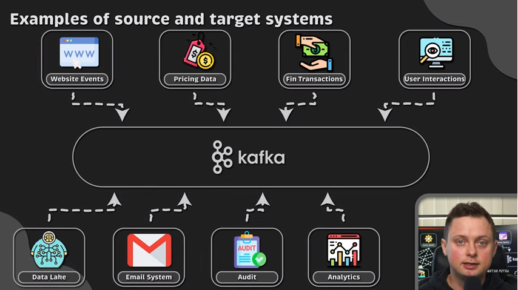

# Apache Kafka

### Terminology
Source system : Database for example --> Producing  
Target system : Datalake or datawarehouse --> Consuming  

###Challenge
Multiple different source system (e.g: 4) and target system (e.g: 4) need lot of integrating system (16).   
What if a property is added in a CSV or a database --> Need to redfine the integartion for a specific source and destination system  

### Product itself
Designed to both receive and distribute data --> One access point  
Used as a messaging system, collecting logs, collecting metrics, activity tracking (user clicks for ex)
Perks :
- This is more organized and scalable   
- Distributed, resilient and FT archi  
- Hihg perf (latency, queue etc...)  

# Bazar 

## Virtu
XEN vs KVM  

## Perf : 
openSLO : stress test avec value YAML 
locust : perf

## Editeur  
Neovim  
Lazygit  

## Language
Python : 
- pydantic : faire de la validation de données (https://docs.pydantic.dev/latest/usage/validators/)  
- textual python : R3 ?

###Frontend :  
htmx : Permet de faire du HTML avec du beau JS  
AlpineJS : Framework trèèèèèèès simple (seuelement 14 keyword)  
Slvet : Très puissant  

###Backend : 
Mojo : language type python++
Zig: C en mieux

## Reverse proxy 
Kong (reverse proxy ontop of nginx)  
OpenRusty (en Lua) --> TCLlike  

## Autre
Youtube : 
Handmade hero
